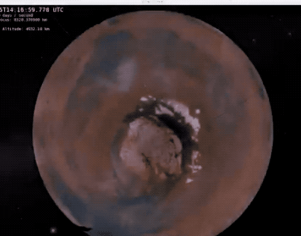
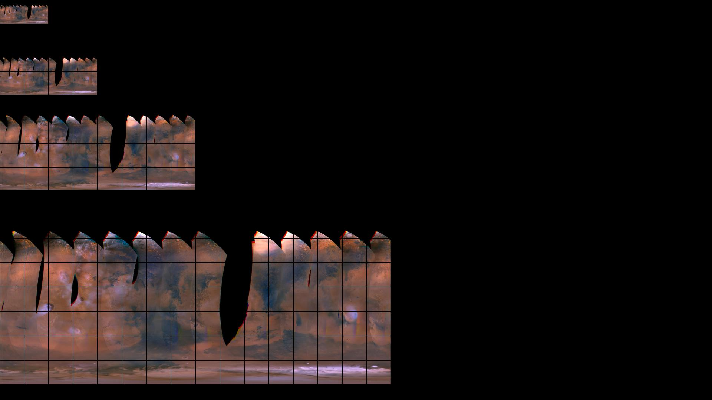

## TeamWatney
Getting weather data for Watney into OpenSpace!

### Addressing [Partly Cloudy Skies on Earth and Mars](https://github.com/amnh/HackTheSolarSystem/wiki/Partly-Cloudy-Skies-on-Earth-and-Mars)

### Created by TeamWatney
* Brandon Liu [@bdon](https://github.com/bdon)
* Alex Kramer [@mitochondrion](https://github.com/mitochondrion)
* James Somers [@jsom](https://github.com/jsom)
* Ventrice Lam [@ventersaurus](https://github.com/ventersaurus)
* Ming Liu [@mingenuity](https://github.com/mingenuity)
* Karoline Dubin [@karolinedubin](https://github.com/karolinedubin)

### Solution Description

Use OpenSpace's globebrowsing module to visualize weather on Mars and to create a pipeline to get this data from NASA into OpenSpace.

Our solution improves on existing Temporal WMS data pipeline in OpenSpace. We plan on working with AMNH to host data so anyone can view it immediately. The pipeline we created is general purpose for any planet and any temporal image dataset. Our data flow is a significant improvement from the existing method to get temporal data into OpenSpace. We also added a zoom control patch to OpenSpace v 0.13 for faster flying around space!

The data source used: Mars Color Imager (MARCI) from USGS.gov for daily maps of the Martian atmosphere. Images pulled are converted to JPEG tiles using the GDAL toolchain and Python Imaging Library.

Our python script converts timestamped images to WMS tile directories, and we created an OpenSpace Temporal Tile Layer XML to show the weather data. 

An interesting issue: some of the satellite data we pulled had was still raw, and it took time to realize these were unprocessed because of the government shutdown. If the government remained shutdown, the servers where we pulled images from would not be working. This presents an interesting issue for open source science: how to handle missing data and prevent against future data gaps.

### Installation Instructions

* GDAL/OGR 2+
* Python 3
* OpenSpace 0.12+

